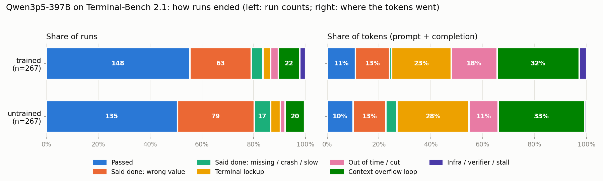

# Qwen3.5-397B on Terminal-Bench 2.1: trained vs untrained

**Setup.** Same model, two versions: *untrained* (`qwen35-397b-a17b-base`) and *trained* (`qwen35-397b-a17b-gs264`, post-trained). Same harness (Terminus: the model types commands into a terminal), same 89 tasks, 3 attempts ("runs") per task each, temperature 0.6. 534 runs total. Each run is pass/fail by hidden tests.

**Method.** Everything below is computed by `report.py` from fields already in the traces: no LLM judge, no API calls. Numbers come from `results/report_Qwen3p5-397B/metrics.json`; every run's label is in `results.jsonl`. Confidence intervals (CI) are 95%, from resampling tasks (10,000 draws, seed 0), and the trained/untrained comparison is always *paired* (same task vs same task).

*Left: what happened in each of the 267 runs per variant. Right: where the tokens went. Passing runs use only ~10% of all tokens.*

---

## 1. Did the model get better?

**Yes, a little. The gain is real but small, and trial noise is large.**

| | Trained | Untrained | Difference (paired) |
|---|---|---|---|
| **pass@1** (share of single runs that pass) | **55.4%** [46.1, 64.4] | 50.6% [41.2, 59.9] | **+4.9 pts** [+0.4, +9.7] |
| **pass@3** (share of tasks solved in any of 3 tries) | 67.4% [57.3, 76.4] | 64.0% [53.9, 74.2] | +3.4 pts [−2.2, +9.0] |

- **pass@1 gain clears zero; pass@3 does not.** Trained solves a task *more reliably*, not many *new* tasks: only 5 tasks are solved by trained alone vs 2 by untrained alone (55 both, 27 neither).
- **Task by task:** trained scores higher on 16 tasks, lower on 7, ties on 66 (sign test p = 0.09). 12 of the 16 wins are by a single run out of 3.
- **Harness failures hide part of the gain.** Removing runs that failed for reasons outside the model makes the gain *bigger*, not smaller:

| Runs excluded | Tasks | Gain (pass@1) |
|---|---|---|
| none | 89 | +4.9 [+0.4, +9.7] |
| infra errors, verifier short-runs, suspected server stalls | 89 | +6.0 [+1.9, +10.9] |
| … and context-overflow loops | 84 | +6.6 [+2.0, +11.5] |
| 7 suspect tasks only | 82 | +4.9 [0.0, +10.2] |
| all of the above | 77 | +6.7 [+1.7, +11.9] |

- **Where:** System Administration moves most (70% vs 52%), then Model Training (67% vs 50%). Most other categories are within a few points.

## 2. How did behaviour change?

**Trained claims "done" falsely less often and is better at driving interactive programs. It thinks more and runs longer, without getting faster.**

| Behaviour (runs, out of 267 each) | Trained | Untrained |
|---|---|---|
| Said "done" (confirmed) but tests failed | **77 of 223 (34.5%)** | 97 of 231 (42.0%) |
| Backed off after the harness asked "are you sure?" | 84 | 72 |
| Terminal lockup (≥20 turns in a row saying "stuck") | 10 (1 recovered) | 13 (2 recovered) |
| Hit the 3-hour wall-clock cap | 44 | 35 |
| Total wall-clock | 194 h | 164 h |

**Cost on the 30 tasks both variants always pass** (same work, paired; ratio trained ÷ untrained): time ×1.10, calls ×1.04, output tokens ×1.06, **thinking tokens ×1.09** (higher on 21 of 30 tasks, p = 0.04). No efficiency gain; slightly more thinking.

**On failures trained keeps going longer:** median failed run 1,619 s / 38 calls / 14.6k thinking tokens vs 1,133 s / 31 calls / 9.1k.

**What it looks like** (runs read by hand; IDs in `metrics.json → q2_behavior.examples`):

- **Checks the real requirement before finishing.** *qemu-alpine-ssh*, trained passes 3/3, untrained 0/3. Trained set up ssh inside the virtual machine, moved it to the background, then logged in from outside, which is exactly what the tests do. One untrained run saw ssh "listening" inside the VM and declared done after 10 calls without that check.
- **Avoids getting trapped by interactive programs, but can't escape once trapped.** Two untrained qemu runs lost control of the VM console; one repeated the same keys for 516 turns (48.6M tokens). Trained is not immune: it spent 488 turns stuck in vim (*large-scale-text-editing*) and ~350 turns trying to close an unfinished text block (*password-recovery*, 64M tokens). Only 3 of 23 trapped runs ever recovered.
- **Makes targeted fixes.** *fix-ocaml-gc*, trained 3/3 vs 1/3: trained found the one-line bug, checked similar loops, changed one line and ran the test suite twice. Untrained runs misdiagnosed it or froze during the build.
- **Reads specs slightly better, not uniformly.** Untrained lost *count-dataset-tokens* by joining two text fields before counting (79,566 vs expected 79,586). Trained lost *sparql-university* 3/3 by applying a filter to the wrong part of the query.

## 3. When trained failed, how did it fail?

Every failed run gets exactly one label (definitions in `metrics.json → meta.ending_definitions`).

| How the failed run ended | Trained (119) | Untrained (132) | Change |
|---|---|---|---|
| **Said done: wrong answer** (output exists, content assertions fail) | **63 (53%)** | 79 (60%) | **−16** |
| Said done: crashed (exception in tests) | 8 | 9 | −1 |
| Said done: too slow / timed out | 2 | 6 | −4 |
| Said done: required file missing | 2 | 2 | 0 |
| Context-overflow loop (history too long → every call empty until the cap) | 22 | 20 | +2 |
| Terminal lockup | 8 | 10 | −2 |
| Ran out of time while still working | 8 | 5 | +3 |
| Suspected server stall (≥10,000 s, <60 calls) | 4 | 0 | +4 |
| Infra error / verifier ran short | 2 | 1 | +1 |

- **Main failure mode for both: a confident wrong answer.** 63% of trained failures and 73% of untrained are the model saying "done" when it isn't. Trained's improvement is mostly *fewer of these* (−20 runs overall).
- **Many are near misses:** in 52 of trained's 75 false-done failures, some tests passed (68 of 96 for untrained).
- **Trained's failures shift toward running long:** more cap hits, and all 4 suspected stalls. Its biggest "loss", *polyglot-rust-c* (1/3 vs 3/3), is two of those stalls: 3 and 8 model calls over ~3 hours, likely the server, not the model.
- **Tasks that decided the comparison:** trained gained on qemu-alpine-ssh (+3), count-dataset-tokens, fix-ocaml-gc, qemu-startup (+2 each) and 12 tasks at +1. It lost polyglot-rust-c (−2, stalls) and 6 tasks at −1.

## 4. Is the scoring trustworthy?

**The pass/fail bit is mostly sound; the time and token numbers are not, and three trials per task are too few to judge any single task.**

- **About 3/4 of all tokens go to runs that are stuck.** Share of tokens: passing runs 11% (trained) / 10% (untrained); lockups and runs out of time 41% / 39%; harness-caused endings 35% / 34%. Raw averages of cost mostly measure the stuck runs.
- **Context-overflow loop (harness setting).** The model's window is 262k tokens and each reply reserves 81,920, so once the history passes ~180k every call returns nothing. The harness then adds an error message, which makes the history longer again, and the run spins until the 3-hour cap. Nothing summarizes or trims the history. 22 trained / 20 untrained failures end this way.
- **Failures not caused by the model:** trained 6 (4 suspected stalls, 1 verifier timeout, 1 verifier download failure), untrained 1 (sandbox shutdown). All are scored 0 today. Removing them *raises* the gain (section 1).
- **7 suspect tasks** (answer key tracks a live leaderboard, a test that can't pass in this harness, leaked weights, environment mismatch; list with reasons in `metrics.json → q4_trust.suspect_tasks`). 6 of 7 fail on every run in both variants; they shift the net difference by only +1 pass.
- **Trial noise:** 18 tasks differ by exactly 1 run of 3, within temperature-0.6 noise. Only the aggregate is testable; single-task differences are anecdotes unless supported by traces.
- **Test isolation gaps:** one run wrote its own `/tests/filter.py` so its local test passed; every *make-doom* run edited the provided `vm.js`. Scoring should restore task files before running tests.
- **Fields you can't trust:** index `reasoning_tokens` / `tool_calls` / `compaction_count` (always 0); `empty_response_loop` (False even in overflow loops); `outcome` ("completed" for 3-hour cap runs); `command_history` (drops text blocks); `final_answer` (claims success on most failures).

## 5. Harness problems and how to fix them

These are problems with the *test setup*, not the model. Together they touch about 1 in 5 runs and about 3/4 of all tokens. In order of impact:

| # | Problem | Evidence in the traces | Fix |
|---|---|---|---|
| 1 | **Context-overflow loop.** Each reply reserves 81,920 of the 262k context. Past ~180k of history every call returns nothing. The harness then adds "Technical difficulties. Please continue" to the history, which makes it longer, so the run spins until the 3-hour cap. Nothing summarizes or trims the history (`compaction_count` is always 0). | 22 trained / 20 untrained failures. The last good prompt is always 176–180k tokens. About 35% of all tokens. | (a) **Summarize or trim old history** above ~150k tokens. (b) **Lower `max_tokens`**: the largest reply seen was 27.7k, so 32k is safe and frees ~50k of context. (c) **Stop after 3 empty replies in a row** and label the run `context_exhausted`, instead of spinning for hours. (d) Don't add the error text to the history. |
| 2 | **Terminal lockups.** A program takes over the terminal (vim, a qemu console, an unclosed text block, a long job running in the foreground). The model can only send keystrokes into that same terminal, so it retries the same escape hundreds of times. | 23 runs trapped, 3 recovered. Up to 516 turns in a row; 64M tokens in one run. | (a) Give the model a **"reset terminal" action** that kills the foreground process group or opens a fresh shell. (b) **Detect repeated identical commands** (say, 10 in a row) and add a hint to the history, or end the run early. (c) **Time out each command** instead of letting a foreground job block the shell. |
| 3 | **One 3-hour cap for every task.** The agent config says "task.toml timeouts", but every unfinished run ended at 10,880–12,070 s, whatever the task. | 44 trained / 35 untrained runs hit the cap. Capped and stuck runs use ~75% of tokens. | **Apply each task's own timeout**, and use the stuck/empty detectors above to end hopeless runs early. |
| 4 | **Suspected serving stalls.** The config has a 600 s timeout per model call, yet 5 trained runs took ~11,000 s for 3–54 calls. One made 3 calls in 11,321 s. | Trained's biggest loss, *polyglot-rust-c* (1/3 vs 3/3), is 2 of these. | **Enforce the per-call timeout, retry, and record timestamps for every call.** Label these runs `infra` and re-run them automatically instead of scoring 0. |
| 5 | **Grading failures scored as 0.** Sandbox shut down mid-run (`ConflictError`). Verifier timed out after 1,800 s. Verifier's dependency download returned HTTP 504 (`uvx: command not found`), so no tests ran. | 3 runs (2 trained, 1 untrained). | **Record these as "not graded", not 0**, and retry. **Pre-install verifier dependencies** in the image so grading doesn't need the network. |
| 6 | **Agent can change the grading files.** One run wrote its own `/tests/filter.py`. Every *make-doom* run edited the provided `vm.js`. | Found by reading traces. Not measured across all runs. | **Mount tests read-only**, and **restore provided files before grading**. |
| 7 | **Logging gaps.** The model's actual commands and its "task complete" flag are not saved. `command_history` drops text blocks. No per-call timestamps. Several counters never change (`reasoning_tokens`, `tool_calls`, `compaction_count` are always 0; `empty_response_loop` is always False; `outcome` says "completed" for capped runs). | Every run. | **Save the raw model reply and per-call timing, and fix the counters.** Without this, lockups and stalls can only be *inferred*, as they were here. |

**Expected effect of fixing 1–5:** most of the ~45 overflow runs and ~79 capped runs would end early or finish, saving about 3/4 of today's tokens. Harness zeros would stop hiding part of the trained gain (+4.9 → about +6 points once they're removed, section 1). Fixes 6–7 don't change scores much, but they make them trustworthy and explainable.

## 6. LLM judge on part of the failures (`results/grade_q397b_sonnet`)

A Sonnet 5 judge (`grader.py --fails-only --max-prompt-tokens 50000`, about $10) read **135 of the 251 failed runs** (58 trained, 77 untrained). It skipped runs already labelled by rule (45 overflow loops, 4 stalls, 3 infra errors) and every transcript over 50k tokens (64 runs), which includes every long lockup. **So it describes short failures only; it did not see the big stuck runs.**

| Judge says (short failures only) | Trained (58) | Untrained (77) |
|---|---|---|
| Implementation bug | 19 (33%) | 34 (44%) |
| Checked its own work, still wrong | 14 (24%) | 10 (13%) |
| Wrong approach | 14 | 19 |
| Declared done without checking | 5 | 7 |
| Misread the task | 4 | 5 |
| Verification score (1–5, mean) | 2.81 | 2.53 |
| Wasted turns (judge's estimate) | 26% | 30% |

- **Same direction as the rest of the report:** trained's failures are more often "checked and still wrong", untrained's more often plain bugs. That fits trained checking its work more.
- **Not validated.** On 3 runs I diagnosed by hand, the judge's *main* label matched none exactly. It called a spec misread (count-dataset-tokens) an implementation bug, and the untested qemu claim an implementation bug, with "declared done without checking" only as the second label. Its labels are hints, not findings.
- Its "false completion" flag is set on ~90% of both variants' judged failures, so it doesn't separate them.

## Limits of this analysis

- Failure labels describe *what* went wrong (from the hidden tests' own output), not *why*. "Wrong answer" mixes misread specs, bad approaches and bugs; separating them needs reading traces or an LLM judge (`grader.py`, ~$0.20/run).
- Lockup detection reads the model's own words ("terminal is stuck"), because the traces don't record its actual keystrokes.
- "Suspected stall" is inferred from timing; it is not confirmed from server logs.
- Recommended re-runs: the 6 harness-failed trained runs and 1 untrained; the harness with history summarization/trimming turned on; more trials on the 23 tasks where the variants differ.

*Reproduce:* `python report.py` (≈10 s, no API calls). Tests: `pytest tests/test_report.py`.
